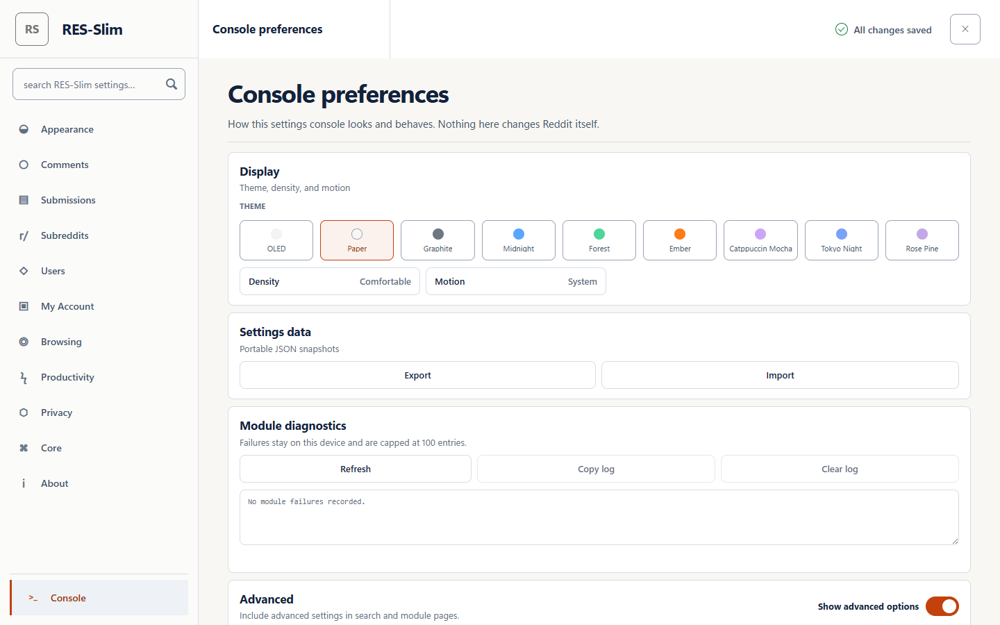

# RES-Slim

  

A stripped-down personal fork of [Reddit Enhancement Suite](https://github.com/honestbleeps/Reddit-Enhancement-Suite) (forked from upstream v5.24.8), targeting **old.reddit.com and current Reddit** on desktop.

The goal is that the two renderers look and behave like one product. Reddit has said it [cannot promise old Reddit will stay](https://tech.slashdot.org/story/26/07/01/1743219/reddit-will-require-you-to-log-in-to-use-old-reddit) and began requiring a login for it on 2026-06-30, so current Reddit is treated as the renderer that has to work, and the classic interface is something this extension *reproduces* there rather than something it depends on. Built for one person's use and published as-is. There is no support commitment and no release cadence.

Only the features actually used are kept. Upstream self-promotion, sponsorship, announcements, and cloud-backup code have been removed.

## What's kept

**Comment tweaks**: hideChildComments, commentNavigator, commentPreview, commentTools, commentQuickCollapse, commentSortBy, commentStyle, commentDepth, commentHidePersistor, saveComments, hover, showParent, readComments, newCommentCount, spoilerTags, noParticipation, sourceSnudown.

The optional subreddit emoji module restores known custom emoji tokens in old Reddit comments as inline images. Unknown tokens stay as selectable text. Metadata comes from Reddit through the signed-in browser session and is cached locally for seven days.

**Media tweaks**: `showImages` inline expando engine plus all 73 host handlers (imgur, youtube, reddit-native, Mastodon, Threads, etc.).

**Appearance**: `pageTheme` defaults to **Classic Reddit**, a measured white-and-blue recreation of the archived desktop interface. On current Reddit it removes the permanent left rail, restores a 300px information sidebar, and uses 72px listing rows with a 43px native vote rail and 70px thumbnails. Titles return to 16px Verdana blue links. Cards, rounding, metadata and action links follow the old desktop hierarchy. Community mastheads, sort controls and highlights become compact strips instead of large cards, while feed errors and the discussion composer receive deliberate classic states. Native current-Reddit voting, comments, sharing, links, collapse, streaming, and routing stay functional. Reddit's own SVG wordmark and action icons remain in place and inherit the selected palette. Image, GIF and video previews load through Reddit's native media elements, become old-Reddit thumbnails in listings, then return to full-width aspect-ratio media when a post is opened. Old Reddit's self, default, link, mature-content and spoiler placeholders use isolated copies of Reddit's artwork, which prevents adjacent sprite cells from leaking into the 70px thumbnail rail. The native vote and action controls stay in their open shadow roots. A small per-post sheet positions the vote rail, while shared Shadow Parts rules handle color and icon sizing. The **layout is not tied to the palette**: the same measured geometry is applied on all eleven palettes, so OLED, Graphite, Midnight, Catppuccin, Tokyo Night, Rosé Pine, Nord, Dracula, Gruvbox, and Solarized give you the classic old-Reddit shape in dark colours on *both* renderers. Every palette also sets `color-scheme`, so scrollbars and native form controls match the theme instead of staying light. Accent correction works in both directions so custom colours remain readable on light and dark surfaces.

**Current Reddit compatibility**: a Web3X/Shreddit adapter translates live post and comment components into the semantic vocabulary used by RES-Slim. Theme controls and the high-value DOM features work across both interfaces, including filtering, promoted-post removal, absolute timestamps, clean outbound links, author context, role highlights, user tags, vote history, layout controls, and scroll restore. The adapter follows streamed posts, nested comments, native comment collapse, SPA navigation, and native vote/action controls. It also follows Reddit's nested `reddit-header-action-items` header and the current `rpl-action-bar` vote structure. Stable controls are exposed as CSS parts for shared paint rules. The smaller per-post stylesheet is gated by the refined-layout toggle rather than by the palette, so the left vote rail appears under every theme.

**User tag data**: JSON imports are a two-step operation in the module settings.
Preview shows valid, invalid, new, and conflicting record counts without writing.
Existing tags win unless you choose replacement. A successful import writes the
whole map once, saves a rollback snapshot, clears the payload, and can export the
exact committed map.

**Browsing**: `hideAll` adds a "hide all" link in the listing tab menu that bulk-hides every post on the page, rate-limited, with undo. Disabled by default.

**Ads and measurement**: an always-on static `declarativeNetRequest` ruleset blocks separable Reddit ad assets, click trackers, pixels, and telemetry requests before load. Promoted records embedded in Reddit's essential first-party listing response are suppressed at `document_start`, counted locally, and rechecked as listings append. No claim is made that those inseparable records disappear from the listing response itself. Current Reddit's ad elements, including the ones that appear inside a discussion, belong to the same module rather than to a theme setting. A second layer patches `sendBeacon`, `fetch` and `XMLHttpRequest` in the page so a telemetry payload is never assembled, which covers transports the network rules do not; it ships as a packaged file the page loads by URL, because Manifest V3 refuses an inline script a content script writes.

**Old Reddit routing**: the optional `www.reddit.com` → `old.reddit.com` preference now installs a dynamic request rule, so the modern document does not download before the host changes. It preserves path, query, and fragment; leaves login, account, and advertising routes alone; and the header’s **www** link provides a one-page escape. The preference remains off by default.

**Ecosystem parity (v0.20.0)**: fifteen modules rewritten from the most-installed old.reddit userscripts, all disabled by default except the two that only repair broken behaviour. The fifteen are `commentShredder` (bulk overwrite-and-delete of your own comments, preview-first with a typed confirmation), `usernameColors`, `systemThemeSync`, `autoLoadMoreComments`, `visitedPosts`, `searchScope`, `flairLinkify`, `reverseImageSearch`, `nsfwThumbnails`, `karmaHide`, `restoreVoteArrows`, `randomSubreddit`, `loginRedirectFix`, plus `brokenLinkFixer` and `preventAutoTranslate` on by default.

**Infrastructure only**: menu, notifications, settingsNavigation, selectedEntry, version, requestPermissions.

**Settings console**: three-column desktop command center with a persistent category rail, focused module rail, editorial settings workspace, explicit On/Off labels, staged-change controls, theme/density/motion controls, page-specific privacy and permission states, and portable data actions. Global search and Console preferences use the full workspace instead of retaining an unrelated empty module rail.

Console preferences also carries a support report. Press Build report and you get your version, your browser, the modules whose enablement or options you have changed, the slowest modules by stage, recent module failures and any selector drift, as plain text to paste into a bug report. It is built only when you press the button and never stored. Anything that could carry something private is described rather than printed, so a subreddit list reports its count and a text field its length. Module timings are measured on the reddit page, so open the console from one if you want them included.

The Selector repair panel is for Reddit markup changes that arrive between
releases. It edits a small local JSON layer over the versioned selector bundle.
Unknown surface names, invalid CSS, duplicate selectors, and incompatible
schemas are refused before storage. Saved overrides load before modules run,
also drive selector drift diagnostics, and can be imported or exported as a
plain JSON file. Nothing is fetched remotely.



The selected 1440×900 design references for all 11 categories, Console preferences, and search live in [`design/mockups/`](design/mockups/). They are reference images only; the shipped interface is HTML/CSS/JavaScript.

## Permissions and privacy

RES-Slim ships no third-party API credentials. Four were inherited from upstream and removed in v0.40.0: the YouTube key went with a metadata function nothing called, Giphy previews use the media paths the id already determines, and Google Maps links preview through OpenStreetMap because Google's Embed API requires a key this project does not own. Tumblr is the exception, because its API is the only route to a post body, so Tumblr previews stay off until you supply your own key in the host's settings.

RES-Slim runs on `https://*.reddit.com/*` and stores settings and optional local feature data in the browser profile. `declarativeNetRequest` is used for the packaged Reddit-scoped block rules and the user-controlled Old Reddit redirect described above. Optional host permissions are requested only when a media provider or localhost companion needs one. The extension contains no analytics and sends no RES-Slim telemetry.

## Build

```bash
yarn install
yarn verify     # every gate, in order, stops at the first failure
yarn test       # focused fixture checks
yarn test:show-images
yarn test:privacy
yarn test:e2e   # loads the built extension in Chromium (headless) and drives it
yarn firefox:audit  # loads the built MV2 add-on in a real Firefox and drives it
yarn manifest   # regenerate both manifests from manifest.config.js
yarn once       # dev build -> dist/
yarn build      # production build + zip -> dist/zip/
```

The build generates a metadata-only module catalog for the settings page. This
keeps runtime module code and large media dependencies out of the options
bundle while preserving the same settings schema. Module page conditions are
declared through `include`, `exclude`, and `asLongAs`. Lifecycle hooks receive a
shared abort signal that fires when the page is left, so long-lived work has one
consistent teardown path. A file-derived contract also requires every module to
be registered, described, and paired with either its own stylesheet or an
explicit styleless declaration. Reddit's Markdown renderer is a separate 62 KB
production entry and loads only when Markdown is actually rendered, keeping it
out of the content script parsed at the start of every Reddit page.

`yarn verify` runs lint, Flow, the unit suite, a production build, the e2e suite,
the third-party endpoint probe, and an advisory check that the published GitHub
description still matches this README, in that order, stopping at the first
failure. It is the one command worth running before a push; the individual
scripts above are for iterating on a single gate. `yarn verify --skip-network`
omits the two network steps, which are the only ones that can fail for reasons
outside this repository. The metadata check reports drift but never fails a
push, since it needs a `gh` login as well as a network.

To run it automatically before every push, enable the shipped hook once per
clone:

```bash
git config core.hooksPath .githooks
```

`git push --no-verify` skips it when you genuinely need to.

`yarn test:e2e` rebuilds first, then launches Playwright's Chromium with
`dist/chrome/` loaded and checks that the service worker is alive, the packaged
ad rules block a real browser request, all settings states render, promoted
records stay hidden across asynchronous insertion, and the content script
initialises on served old-Reddit and current-Reddit documents. It also checks the
default refined Classic layout, keyboard focus treatment, feed hierarchy,
opened-post and media geometry, the discussion composer and sort toolbar,
nested-comment surfaces, Shreddit semantic adaptation, SPA navigation, streamed
posts, native comment collapse, and open-shadow-root vote controls. Current
Reddit screenshots cover desktop, 960px, 640px and a dark palette, with
horizontal overflow and focus visibility checked before capture. The current
Reddit fixtures use the source wordmark and action SVG paths, a decoded bitmap,
and a local H.264 clip. The suite checks natural media dimensions, video
readiness, thumbnail crops, opened-post aspect ratio and icon visibility. It also
checks that the telemetry patch reached the page world on both renderers, that
an ad inside a discussion is removed with the theme setting off, and that
selector drift is reported on a deliberately broken current-Reddit fixture and
not on a clean one. It needs no
physical display, no existing browser profile, and no network: every request is
either served from a local fixture or intercepted, and
the browser is launched with DNS for everything but localhost pointed at a dead
address so that stays true. Screenshots land in `tests/e2e/screenshots/`. Set
`RES_E2E_HEADED=1` to watch it run.

`yarn firefox:audit` is the Firefox half, and it is not part of `yarn verify`
because it needs a Firefox installed on the machine. It installs the built
`dist/firefox/` add-on into a fresh headless profile over WebDriver BiDi, then
checks that the content script runs on a served reddit page, that the settings
console boots, and that the telemetry patch reaches the page world on MV2 as
well as MV3. Set `FIREFOX_PATH` if yours is somewhere unusual, and pass
`--headful` to watch it.

Both browser manifests come from `manifest.config.js`. Everything the two
targets share is written once, each MV2 against MV3 difference is recorded with
the reason for it, and a contract fails if the committed files stop matching.
Run `yarn manifest` after changing anything there.

### Refresh old Reddit fixtures

Save a current public old-Reddit listing or discussion as HTML/MHTML, then run:

```bash
yarn fixture:import path/to/capture.html --kind frontpage --captured-at 2026-08-13T12:00:00Z
yarn fixture:import path/to/capture.mhtml --kind thread --captured-at 2026-08-13T12:00:00Z
```

The importer refuses private Reddit surfaces and captures without the old-Reddit
`xmlns` marker. It reduces the page to a deterministic structural fixture,
replaces account/content identifiers and prose, strips executable or secret-
shaped data, and permits only a reserved non-routable fixture host. Run
`yarn test` and `yarn test:e2e` before committing refreshed fixtures.

## Install (Chrome)

The repo ships no loadable extension. `dist/` is generated, so build it first:

```bash
yarn install
yarn once
```

Then `chrome://extensions` → enable **Developer mode** → **Load unpacked** → select `dist/chrome/`.

Firefox: `about:debugging#/runtime/this-firefox` → **Load Temporary Add-on** → pick any file in `dist/firefox/`.

Two things that look like bugs but aren't:

- **Do not point Chrome at the repo's `chrome/` folder.** That manifest is a build template, with `"name": "__name__"` and `"version": "__version__"` still in it, so Chrome rejects it with *Invalid value for 'version'*. Only `dist/chrome/` is loadable.
- **`--load-extension` on the command line no longer works** in Google Chrome stable (it logs `--load-extension is not allowed in Google Chrome, ignoring` and continues without the extension). Use the Load-unpacked UI above; for scripted checks use a Chrome for Testing / Chromium build, which still honours the flag.

## Updating

There is no automatic update. Neither manifest declares an `update_url` and there is no store listing, so an installed copy stays on whatever version you built. Updating means pulling and rebuilding:

```bash
git pull
yarn install
yarn once
```

Then hit **Reload** on the extension in `chrome://extensions`. Firefox temporary add-ons do not survive a browser restart at all, so reload the folder from `about:debugging` when you need it.

Self-hosted updates would mean CRX3 packing plus a hosted update manifest for Chrome, and AMO signing for Firefox. Neither is set up, and the CRX3 route was dropped deliberately: Chromium 75 and later reject self-signed CRX files with `CRX_REQUIRED_PROOF_MISSING`, so the packed file would not install anyway.

The extension does tell you when it has been updated. Reload it across a minor-version boundary and the first Reddit page you open shows one dismissible notice with a link to that release's notes. Patch releases stay quiet on purpose, since a notice that fires on every fix is one people stop reading.

## Project planning

Planning lives in the working copy, not in git. `.gitignore` ignores `*.md`, and
only `README.md` and `CHANGELOG.md` are checked in past it, so `ROADMAP.md`,
`RESEARCH.md`, `Roadmap_Blocked.md` and the `docs/archive/` history are all
absent after a clone unless you created them. Shipped history is in the commit
log and in `CHANGELOG.md`.

## License

GPL-3.0, inherited from upstream RES. See `LICENSE`.
